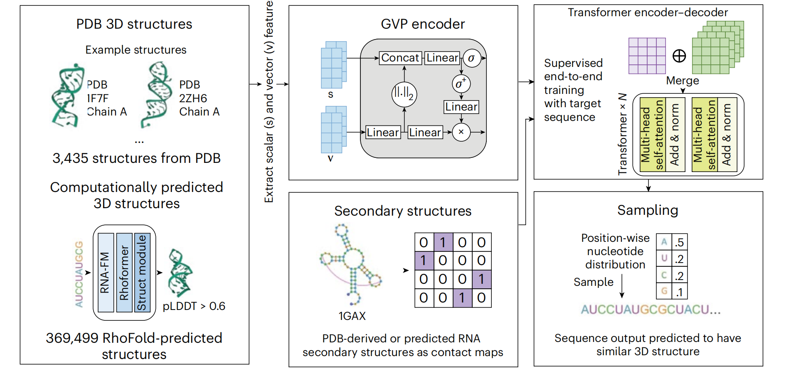

# RhoDesign

RhoDesign is a structure-to-sequence model for RNA design. It leverages Geometric Vector Perceptrons (GVP) encoding and a Transformer encoder-decoder to capture structural details and generate meaningful RNA sequences. This repository contains the source code and data necessary to reproduce the results of RhoDesign.

## Table of Contents

- [RhoDesign](#rhodesign)
  - [Table of Contents](#table-of-contents)
  - [Overview](#overview)
  - [Data and Model Checkpoint](#data-and-model-checkpoint)
  - [Repository Structure](#repository-structure)
  - [Create Environment with Conda ](#create-environment-with-conda-)
  - [Quick Start ](#quick-start-)
  - [Usage](#usage)
  - [Results](#results)
  - [License](#license)

## Overview

RhoDesign is a powerful model that combines geometric encoding, structure constraints, and transformer architecture to enable accurate and diverse RNA sequence design. By leveraging GVP encoding, RhoDesign captures the intricate details of RNA tertiary structures. The transformer architecture further refines the encoded structural information and generates coherent RNA sequences. RhoDesign also utilizes RhoFold to predict additional RNA sequences, augmenting the training data and improving recovery rate metrics.

## Data and Model Checkpoint

Please download the data and model checkpoint from [Google Drive link](https://drive.google.com/drive/folders/1H3Itu6TTfaVErPH50Ly7rmQDxElH3JEz?usp=sharing) and then put all model checkpoints(.pth file) into the checkpoint folder.

## Repository Structure

The repository is organized as follows:

- `src`: Contains the source code for the RhoDesign model.
- `data`: Includes the necessary datasets and files for model training and evaluation.
- `checkpoint`: Stores the trained model checkpoints.

## Create Environment with Conda <a name="Setup_Environment"></a>

### Tested Environment
  - Operating System: Ubuntu 20.04.5
  - CUDA Version: 11.3
  
First, download the repository and create the environment.
```
git clone https://github.com/ml4bio/RhoDesign.git
cd ./RhoDesign
conda env create -f environment.yml
```
Then, activate the "RhoDesign" environment and enter into the workspace.
```
conda activate RhoDesign
```

Note: We have tested the environment on Ubuntu 20.04.5 and CUDA 11.3. If you are using a different CUDA version, please install torch and torch-geometric according to the corresponding CUDA version.

## Quick Start <a name='Quick_Start'></a>

First, Navigate to the `src` directory. And put the pdb file and secondary structure file (contact map with .npy format) into `example` folder. 

```
python inference.py -pdb ./../example/2zh6_B.pdb -ss ./../example/2zh6_B.npy -save ./../example/ -temp 1
```

If you do not have secondary structure file, you can also use the version with only tertiary structure input (pdb file).

```
python inference_without2d.py -pdb ./../example/2zh6_B.pdb -save ./../example/ -temp 1
```

Here, -temp will define the  temperature parameter when sampling. High temperature parameter will cause high diversity of predicted sequences. To ensure the highest recovery rate, we recommend to set `-temp` as 1e-5. To get more diverse sequences, we reconmmend to set `-temp` as 1.

## Usage

To reproduce the results of RhoDesign, follow these steps:

1. Clone the repository to your local machine

2. Navigate to the `src` directory

3. Run the `eval_model.py` script to evaluate the model and reproduce the results

4. The script will load the trained model checkpoints, process the data, and generate the desired results.

For cross-fold validation, please follow the following steps:

1. Find the splited pdb id for cross-fold datasets in the path: data/cross-fold-validation. We have five folds separately for seq-sim < 0.6 and structure-sim < 0.5.

2. Download the pdb and each model checkpoints of the five folds from Google drive. [link: https://drive.google.com/drive/folders/1H3Itu6TTfaVErPH50Ly7rmQDxElH3JEz?usp=sharing]

3. Follow the script in the analysis-notebooks for reproducing the results. Please change the path to the pdb and model checkpoint on your server.

Note: Make sure to have the necessary dependencies installed before running the script.

## Results

The results of RhoDesign can be found in the respective output files generated by the `eval_model.py` script. These files include the evaluated metrics, generated RNA sequences, and any other relevant information.


## License
This project is licensed under the [MIT License](LICENSE).

## Publication
If you find it useful, please cite our paper.
```
@article{wong2024deep,
  title={Deep generative design of RNA aptamers using structural predictions},
  author={Wong, Felix and He, Dongchen and Krishnan, Aarti and Hong, Liang and Wang, Alexander Z and Wang, Jiuming and Hu, Zhihang and Omori, Satotaka and Li, Alicia and Rao, Jiahua and others},
  journal={Nature Computational Science},
  pages={1--11},
  year={2024},
  publisher={Nature Publishing Group}
}
```

